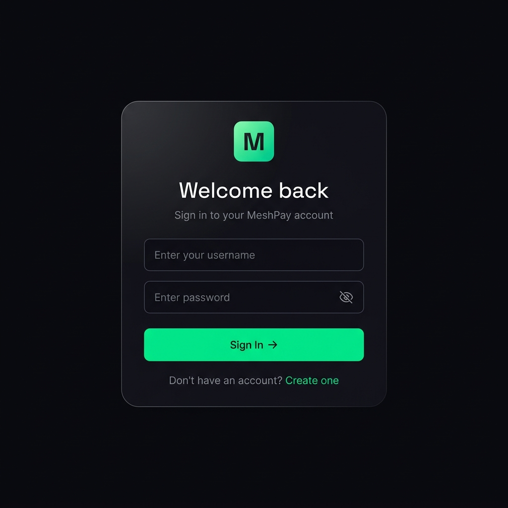
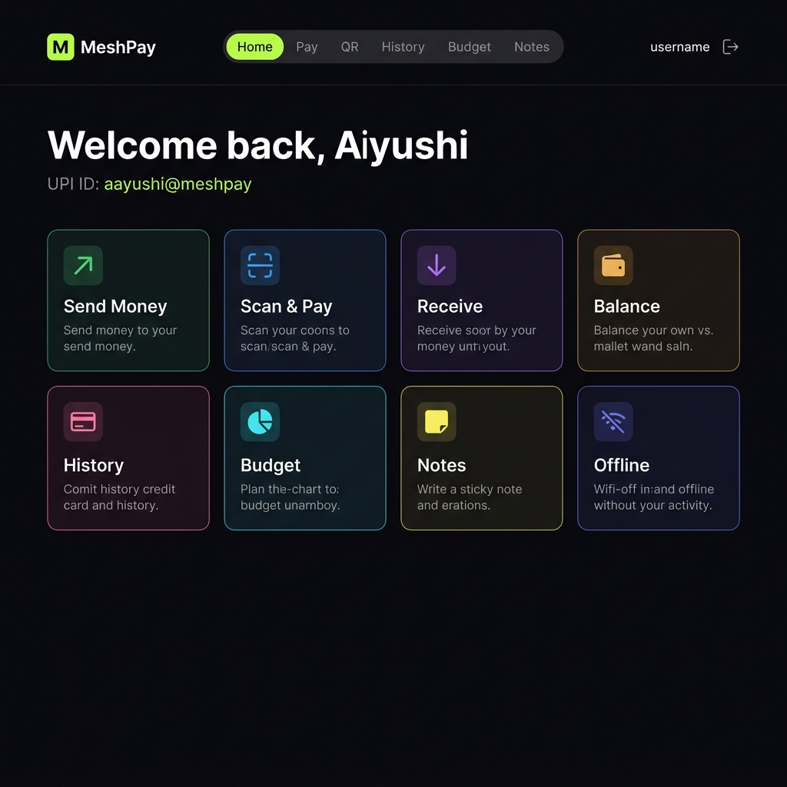
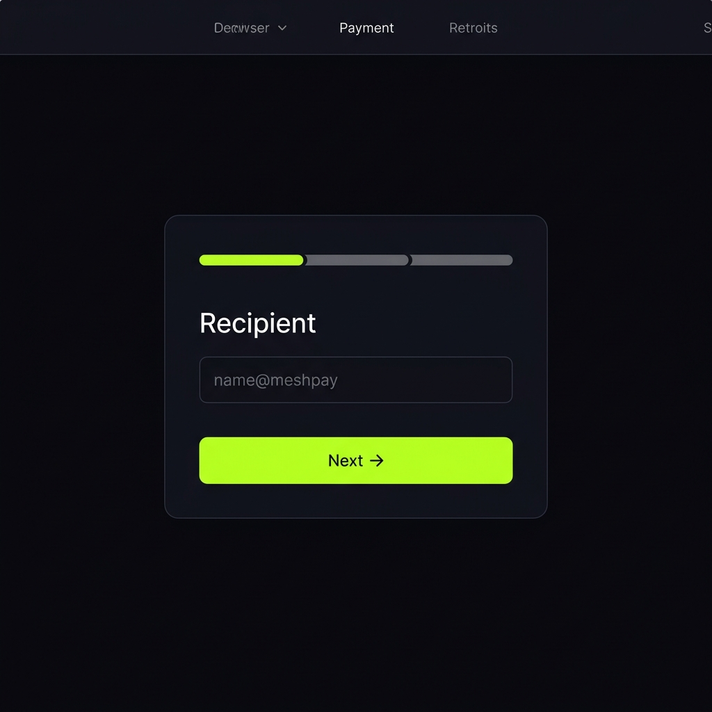
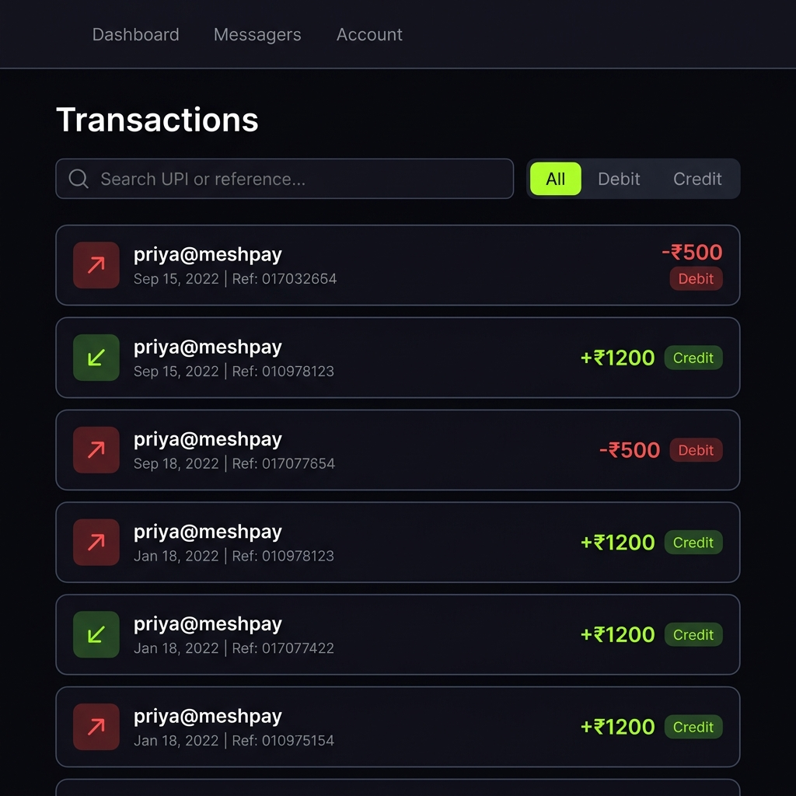
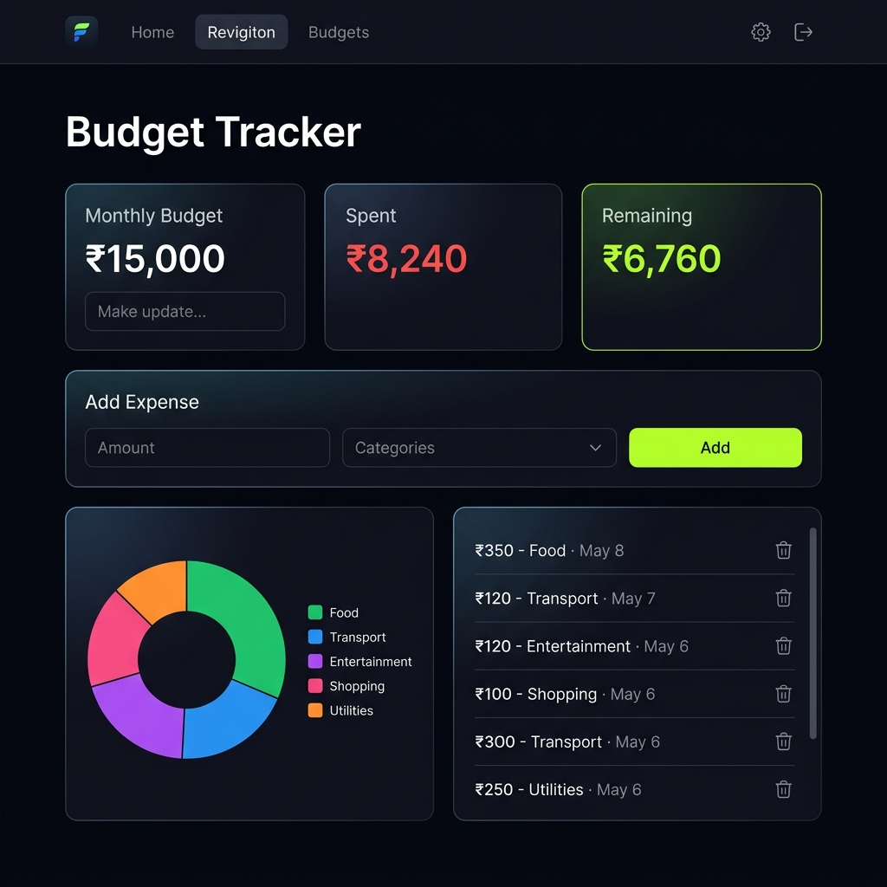
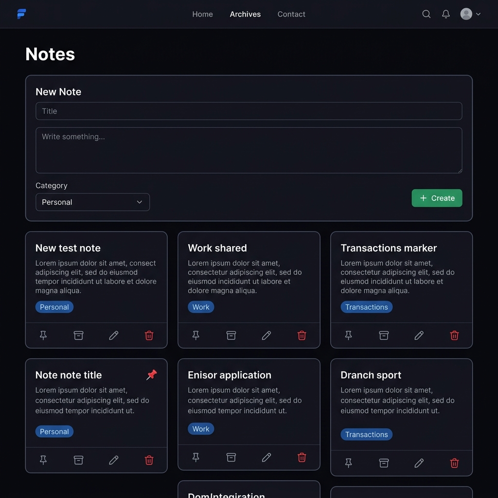

<div align="center">

<br/>

```
███╗   ███╗███████╗███████╗██╗  ██╗██████╗  █████╗ ██╗   ██╗
████╗ ████║██╔════╝██╔════╝██║  ██║██╔══██╗██╔══██╗╚██╗ ██╔╝
██╔████╔██║█████╗  ███████╗███████║██████╔╝███████║ ╚████╔╝ 
██║╚██╔╝██║██╔══╝  ╚════██║██╔══██║██╔═══╝ ██╔══██║  ╚██╔╝  
██║ ╚═╝ ██║███████╗███████║██║  ██║██║     ██║  ██║   ██║   
╚═╝     ╚═╝╚══════╝╚══════╝╚═╝  ╚═╝╚═╝     ╚═╝  ╚═╝   ╚═╝   
```

### **Full-stack fintech platform for seamless UPI payments — online and offline.**

<br/>

[](https://react.dev)
[](https://vitejs.dev)
[](https://nodejs.org)
[](https://expressjs.com)
[](https://mongodb.com)
[](https://jwt.io)

<br/>

[**Live Demo**](#) · [**API Docs**](#api-reference) · [**Architecture**](#architecture)

<br/>

</div>

---

## The Problem

> India processes **₹20 trillion in UPI transactions every month.** Yet 40% of the population still can't transact when they lose internet connectivity — in rural areas, metro dead zones, or during network outages.

Existing apps like GPay and PhonePe are online-first. When the internet drops, payments stop.

**MeshPay doesn't.**

---

## What Makes MeshPay Different

| Feature | GPay / PhonePe | MeshPay |
|---------|---------------|---------|
| Online UPI payments | ✅ | ✅ |
| Works without internet | ❌ | ✅ via SMS fallback |
| QR-based offline payments | ❌ | ✅ |
| Budget analytics | ❌ | ✅ |
| Encrypted PIN auth | ✅ | ✅ bcrypt-hashed |
| Open source + self-hostable | ❌ | ✅ |

MeshPay implements an **SMS-based offline transaction protocol** — when a user has no internet, the payment request is encoded, base64-serialized, and dispatched as an SMS to a Twilio-powered relay server that processes the transaction and responds with a confirmation SMS. Zero internet required on the client side.

---

## Core Features

### 💳 UPI Payments Engine
Multi-step payment wizard with UPI validation, PIN verification (bcrypt), atomic balance transfers, and auto-generated reference numbers. Prevents self-transfers, validates receiver existence before charging PIN.

### 📡 Offline-First Payment Protocol
QR code scanning → amount entry → PIN → base64-encoded SMS payload dispatched to Twilio relay. The server decodes, validates, processes the transaction, and responds via SMS. Designed for zero-connectivity environments.

### 🔐 Secure Authentication System
JWT-based stateless auth with 7-day expiry. PINs are hashed independently from passwords using bcrypt (12 rounds). Passwords never returned in API responses. Auth middleware is centralized — no duplicated token logic.

### 📊 Budget Intelligence
Monthly spend tracking with category breakdowns (Food, Transport, Entertainment, etc.), Recharts pie chart analytics, 90% budget threshold warnings, and per-expense CRUD. Data persisted per-user in a dedicated Budget collection.

### 🧾 Transaction Ledger
Reverse-chronological transaction history with real-time search by UPI ID or reference number, type filtering (Debit/Credit), and badge-based status indicators.

### 📸 QR Identity Layer
Structured QR payload (`{ v: 1, type: "upi_request", upiId, userId }`) — versioned for forward compatibility. Canvas-based QR download. One-click UPI clipboard copy.

### 📝 Contextual Notes
Pin, archive, categorize, and CRUD personal/work/transaction notes. Sorted by pin status. Full ownership enforcement — users can only access their own notes.

---

## Screenshots


<div align="center">

| Login | Dashboard |
|:-----:|:---------:|
|  |  |

| Send Money | Transaction History |
|:----------:|:-------------------:|
|  |  |

| Budget Tracker | QR Code |
|:--------------:|:-------:|
|  |  |

| Notes |
|:-----:|
|  |

</div>

---


## Architecture

```
┌─────────────────────────────────────────────────────────────┐
│                        CLIENT (React 19 + Vite)             │
│                                                             │
│  ┌──────────┐  ┌──────────────┐  ┌─────────────────────┐   │
│  │AuthContext│  │  API Layer   │  │   Route Guards      │   │
│  │(useAuth) │  │ lib/api.js   │  │ProtectedRoute       │   │
│  └──────────┘  │ interceptors │  │GuestRoute           │   │
│                └──────┬───────┘  └─────────────────────┘   │
│                       │ axios + JWT header injection        │
└───────────────────────┼─────────────────────────────────────┘
                        │ HTTPS / REST
┌───────────────────────┼─────────────────────────────────────┐
│                  SERVER (Express)                           │
│                       │                                     │
│  ┌────────────────────▼──────────────────────────────────┐  │
│  │                  Middleware Stack                     │  │
│  │  cors → json(10kb) → morgan → auth.js → errorHandler │  │
│  └────────────────────┬──────────────────────────────────┘  │
│                       │                                     │
│  ┌──────────┐  ┌──────▼──────┐  ┌──────────┐  ┌────────┐   │
│  │/api/auth │  │/api/payments│  │/api/budget│  │/api/   │   │
│  │          │  │             │  │           │  │notes   │   │
│  └──────────┘  └──────┬──────┘  └──────────┘  └────────┘   │
│                       │                                     │
│              ┌────────▼────────┐                            │
│              │   Controllers   │                            │
│              │ authController  │                            │
│              │ paymentController                            │
│              │ budgetController│                            │
│              │ noteController  │                            │
│              └────────┬────────┘                            │
└───────────────────────┼─────────────────────────────────────┘
                        │ Mongoose ODM
┌───────────────────────┼─────────────────────────────────────┐
│              MongoDB Atlas                                  │
│                       │                                     │
│  ┌──────────┐  ┌──────┴──────┐  ┌──────────┐               │
│  │  User    │  │   Budget    │  │   Note   │               │
│  │ (+ txns) │  │(+ expenses) │  │          │               │
│  └──────────┘  └─────────────┘  └──────────┘               │
└─────────────────────────────────────────────────────────────┘

                    OFFLINE PATH
┌──────────────────────────────────────────────────────────┐
│  Client → btoa(JSON payload) → SMS via sms: URI          │
│       → Twilio Webhook → Server decodes → processes      │
│       → Twilio sends confirmation SMS back to user       │
└──────────────────────────────────────────────────────────┘
```

---

## Tech Stack

### Frontend
| | Technology | Why |
|--|-----------|-----|
| ⚡ | **React 19** + **Vite 8** | Concurrent rendering, sub-second HMR |
| 🎨 | **Vanilla CSS** design system | Zero runtime overhead, full control |
| 🔀 | **React Router v7** | File-based client routing |
| 📡 | **Axios** + interceptors | Centralized API layer, auto-token injection |
| 🏗️ | **React Context** | Lightweight auth state (no Redux overhead) |
| 📊 | **Recharts** | SVG-based budget analytics |
| 📷 | **@yudiel/react-qr-scanner** | Camera-based QR scanning |
| 🎭 | **Framer Motion** | Page transitions |
| 🔔 | **React Hot Toast** | Non-blocking feedback |

### Backend
| | Technology | Why |
|--|-----------|-----|
| 🚀 | **Node.js** + **Express** | Non-blocking I/O, minimal overhead |
| 🍃 | **MongoDB** + **Mongoose** | Flexible schema for transactions, embedded docs |
| 🔐 | **bcryptjs** (12 rounds) | PIN + password hashing |
| 🎫 | **jsonwebtoken** | Stateless auth, 7-day expiry |
| 📱 | **Twilio** | SMS relay for offline payments |
| 📋 | **Morgan** | Structured HTTP logging |

---

## Folder Structure

```
MeshPay/
│
├── client/                         # React + Vite frontend
│   ├── src/
│   │   ├── components/
│   │   │   ├── Login.jsx           # Auth screens
│   │   │   ├── Signup.jsx
│   │   │   ├── ProtectedRoute.jsx  # Route guards
│   │   │   └── navbar/
│   │   │       ├── Navbar.jsx
│   │   │       └── Navbar.css
│   │   ├── context/
│   │   │   └── AuthContext.jsx     # Global auth state
│   │   ├── lib/
│   │   │   └── api.js              # Axios instance + endpoint map
│   │   ├── pages/
│   │   │   ├── Dashboard.jsx       # Home screen
│   │   │   ├── online/
│   │   │   │   ├── PayUPI.jsx
│   │   │   │   ├── Transaction.jsx
│   │   │   │   ├── CheckBalance.jsx
│   │   │   │   ├── QrCode.jsx
│   │   │   │   └── QrScanner.jsx
│   │   │   ├── offline/
│   │   │   │   ├── OfflinePay.jsx
│   │   │   │   └── PayUPIOffline.jsx
│   │   │   └── utility/
│   │   │       ├── BudgetTracker.jsx
│   │   │       └── EnhancedOfflineNotes.jsx
│   │   ├── App.jsx                 # Router + providers + lazy loading
│   │   ├── App.css                 # Auth page styles
│   │   └── index.css               # Design system (tokens + components)
│   ├── index.html
│   └── vite.config.js              # Path aliases + dev proxy
│
└── server/                         # Express API
    ├── config/
    │   └── dbConnect.js            # MongoDB connection
    ├── controllers/
    │   ├── authController.js       # register / login / me / verify-pin
    │   ├── paymentController.js    # send / balance / offline
    │   ├── budgetController.js     # budget + expense CRUD
    │   └── NoteController.js       # note CRUD
    ├── middleware/
    │   ├── auth.js                 # JWT verification, attaches req.user
    │   └── errorHandler.js         # Global error handler + asyncHandler
    ├── models/
    │   ├── User.js                 # User + embedded transactions
    │   ├── Budget.js               # Budget + expense list + categories
    │   └── Note.js                 # Notes with pin/archive
    ├── routes/
    │   ├── authRoutes.js
    │   ├── paymentRoutes.js
    │   ├── budgetApiRoutes.js
    │   └── noteApiRoutes.js
    ├── .env.example
    └── index.js                    # Server entry, middleware stack
```

---

## Getting Started

### Prerequisites
- Node.js ≥ 18
- MongoDB Atlas account (free tier works)

### 1. Clone

```bash
git clone https://github.com/Aayushiii25/MeshPay.git
cd MeshPay
```

### 2. Configure backend

```bash
cd server
cp .env.example .env
# Edit .env with your values
npm install
```

### 3. Configure frontend

```bash
cd client
# Create .env with:
echo "VITE_API_URL=http://localhost:8000" > .env
npm install
```

### 4. Run

```bash
# Terminal 1
cd server && npm run dev

# Terminal 2
cd client && npm run dev
```

Open **http://localhost:5173**

---

## Environment Variables

### `server/.env`

```env
PORT=8000
MONGO_URI=mongodb+srv://<user>:<password>@cluster.mongodb.net/meshpay
SECRET_KEY=your_jwt_secret_minimum_32_chars
NODE_ENV=development

# Optional — enables offline SMS payments
TWILIO_ACCOUNT_SID=ACxxxxxxxxxxxxxxxxxxxxxxxxxxxxxxxx
TWILIO_AUTH_TOKEN=your_auth_token
TWILIO_PHONE_NUMBER=+17752787510
MY_PHONE_NUMBER=+91XXXXXXXXXX
```

### `client/.env`

```env
VITE_API_URL=http://localhost:8000
```

---

## API Reference

### Authentication — `/api/auth`

| Method | Endpoint | Auth | Body | Description |
|--------|----------|------|------|-------------|
| `POST` | `/register` | — | `{userName, fullName, email, password, phoneNo, pin}` | Create account |
| `POST` | `/login` | — | `{userName, password}` | Returns JWT + user |
| `GET` | `/me` | ✅ | — | Current user data |
| `POST` | `/verify-pin` | ✅ | `{pin}` | PIN verification gate |

### Payments — `/api/payments`

| Method | Endpoint | Auth | Body | Description |
|--------|----------|------|------|-------------|
| `POST` | `/send` | ✅ | `{receiverUpi, amount, pin}` | Send money via UPI |
| `POST` | `/check-balance` | ✅ | `{pin}` | View balance (PIN-gated) |
| `POST` | `/send-offline` | — | `{message}` | SMS relay endpoint |

### Budget — `/api/budget`

| Method | Endpoint | Auth | Body | Description |
|--------|----------|------|------|-------------|
| `GET` | `/` | ✅ | — | Budget summary + categories |
| `POST` | `/update` | ✅ | `{budget}` | Set monthly budget |
| `POST` | `/expense` | ✅ | `{amount, category}` | Log expense |
| `GET` | `/expenses` | ✅ | — | Full expense list |
| `PUT` | `/expense/:id` | ✅ | `{amount, category}` | Edit expense |
| `DELETE` | `/expense/:id` | ✅ | — | Delete expense |

### Notes — `/api/notes`

| Method | Endpoint | Auth | Body | Description |
|--------|----------|------|------|-------------|
| `GET` | `/` | ✅ | — | All notes (pinned first) |
| `POST` | `/` | ✅ | `{title, content, category}` | Create note |
| `PUT` | `/:id` | ✅ | `{...fields}` | Update (incl. pin/archive) |
| `DELETE` | `/:id` | ✅ | — | Delete note |

---

## Security & Authentication

```
Registration:  password → bcrypt(12 rounds) → stored hash
               pin      → bcrypt(12 rounds) → stored hash (separate)

Login:         bcrypt.compare(input, hash) → JWT(userId, 7d)

Every request: Authorization: Bearer <token>
               ↓ auth middleware
               jwt.verify → User.findById → req.user

PIN actions:   user.matchPin(enteredPin) → bcrypt.compare
               (Never stored, never logged, never in API response)

API response:  toJSON() strips password + pin from every User object
```

**Additional hardening:**
- Request body capped at **10KB** (DoS prevention)
- CORS restricted to configured `CLIENT_URL` (not `*`)
- HTTP 401 on expired/invalid tokens with auto-redirect on frontend
- Ownership enforcement on all note + budget queries (`userId` filter)
- Self-transfer prevention on payment endpoint

---

## Engineering Challenges Solved

### 1. Offline Payment Protocol
**Problem:** Standard UPI requires active internet. How do you transact in zero-connectivity environments?

**Solution:** Designed a structured JSON payload that gets base64-encoded and dispatched as an SMS body via the browser's native `sms:` URI scheme. A Twilio webhook endpoint on the server receives, decodes, validates, and processes the transaction — then sends a confirmation SMS back. No internet required on the client side at payment time.

### 2. Centralized Auth Without Redux
**Problem:** Auth state (user object, loading, logout) was scattered across 12+ components, all reading localStorage directly.

**Solution:** React Context with a single `AuthContext` that owns the auth lifecycle. One `useAuth()` hook. Token injection handled by an Axios request interceptor — components never touch localStorage directly. 401 responses globally redirect without per-component handling.

### 3. PIN Security
**Problem:** Financial PINs were stored as plaintext Numbers in MongoDB. Anyone with DB read access had all PINs.

**Solution:** PINs are hashed independently from passwords using bcrypt (12 rounds) via a dedicated `pre-save` hook. A `matchPin()` instance method handles comparison. PINs are stripped from all API responses via `toJSON()`.

### 4. Duplicate Feature Detection
**Problem:** `NoteController.js` was byte-for-byte identical to `MoneyController.js`. `budgetRoutes.js` contained a Mongoose User schema, not routes. Two entire features (Notes + Budget) were silently broken.

**Solution:** Detected via file size comparison + content audit. Rebuilt both from scratch with correct logic, proper model imports, and auth middleware integration.

### 5. Build-Time Dead Code
**Problem:** Tailwind CSS was declared in `index.css` (`@tailwind base/components/utilities`) but never installed — causing all utility classes to silently fail at runtime. Dynamic class names like `` `text-${color}-800` `` were also not purgeable at build time.

**Solution:** Removed Tailwind entirely. Replaced with a custom CSS design system using CSS custom properties (`--accent`, `--bg-card`, `--border`, etc.) — zero build-time dependencies, full runtime predictability.

---

## Scalability Decisions

| Decision | Rationale |
|----------|-----------|
| Embedded transactions in User document | Fast reads for transaction history; acceptable for personal finance scale |
| Separate Budget collection | Budget + expense list grows independently; avoids bloating the User document |
| Stateless JWT auth | Horizontal scaling without session stores |
| `asyncHandler` wrapper | Removes try/catch boilerplate; centralizes unhandled rejections |
| `toJSON()` on User model | Data sanitization at the model layer — no risk of accidental leaks in new routes |
| Lazy-loaded React pages | Initial bundle < 5KB; each page loads on demand |
| API proxy in Vite dev config | Eliminates CORS issues in development without changing production config |

---


---

## Author

**Aayushi Dhurandhar** || **Nehal Pandey**


[](https://github.com/Aayushiii25)
[](https://github.com/nehalpandey)


---

<div align="center">

*Built with obsession over quality.*

</div>
